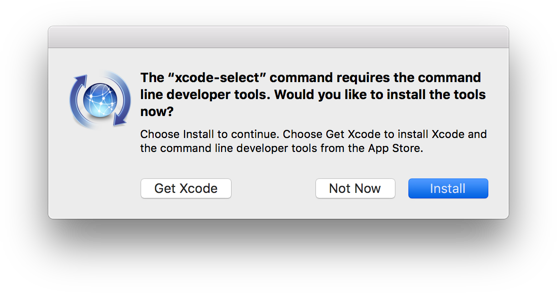
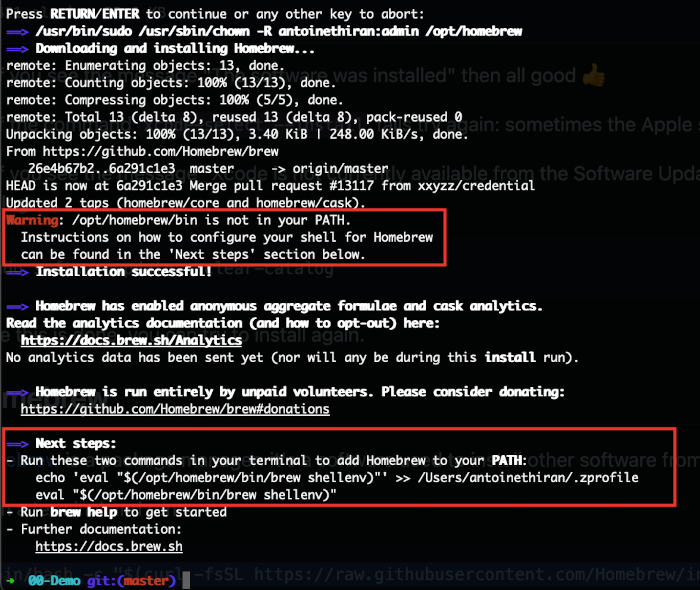
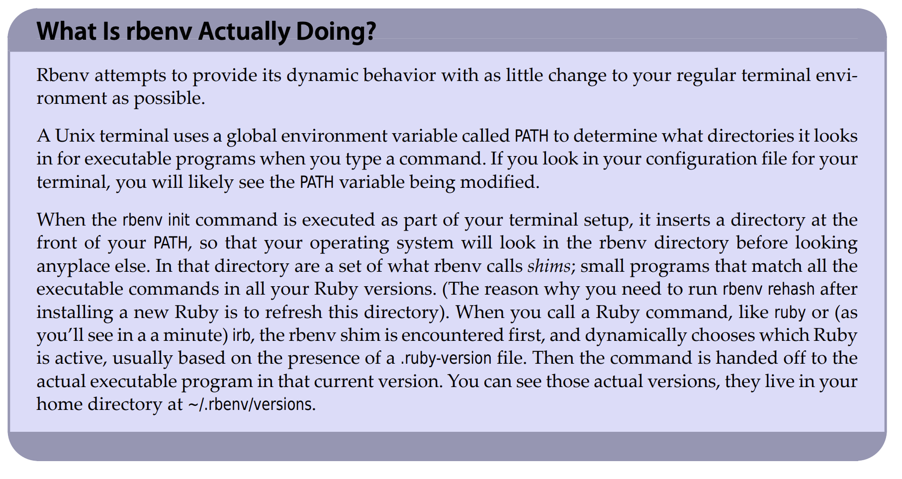

# Setup instructions

You will find below the instructions to set up your computer.

## X-code tools. 💻

Open a new terminal, copy-paste the following command and hit `Enter`:

```bash
xcode-select --install
```

If you receive the following message, you can just skip this step and go to next step.

```bash
# command line tools are already installed, use "Software Update" to install updates
```

Otherwise, it will open a window asking you if you want to install some software: click on "Install" and wait.



:heavy_check_mark: If you see the message "The software was installed" then all good :+1:

:x: If the command `xcode-select --install` fails try again: sometimes the Apple servers are overloaded.

:x: If you see the message "Xcode is not currently available from the Software Update server", you need to update the software update catalog:

```bash
sudo softwareupdate --clear-catalog
```
Some [troubleshooting](https://mac.install.guide/ruby/2.html) on `x-code` installation.


Once this is done, you can try to install again. If you'd like to know more about [x-code](https://en.wikipedia.org/wiki/Xcode).

## Homebrew 🍺

[Homebrew](http://brew.sh/) is the easiest and most flexible way to install the UNIX tools Apple didn’t include with macOS. It can also install software not packaged for your Linux distribution to your home directory without requiring `sudo`.

The two most common mistakes people make when installing Homebrew on an Apple Silicon Mac are:

1. Using Rosetta, or adding "arch -x86_64" to the curl command
2. Missing the instructions at the end of the Homebrew installation that tell you to run some commands to set up your shell

Open a terminal and run:

```bash
/bin/bash -c "$(curl -fsSL https://raw.githubusercontent.com/Homebrew/install/HEAD/install.sh)"
```

This will ask for your confirmation (hit `Enter`) and your **macOS user account password** (the one you use to [log in](https://support.apple.com/en-gb/HT202860) when you reboot your Macbook).

:warning: When you type your password, nothing will show up on the screen, **that's normal**. This is a security feature to mask not only your password as a whole but also its length. Just type your password and when you're done, press `Enter`.

:warning: If you see this warning :point_down:, run the two commands in the `Next steps` section to add Homebrew to your PATH:



```bash
# ⚠️ Only execute these commands if you saw this warning ☝
echo 'eval "$(/opt/homebrew/bin/brew shellenv)"' >> ~/.zprofile
eval "$(/opt/homebrew/bin/brew shellenv)"
```

If you already have Homebrew, it will tell you so, that's fine, go on.

Then install some useful software:

```bash
brew update
```

After you've installed Homebrew, check that Homebrew is installed properly.

```bash
brew doctor
```

You should see:

```bash
Your system is ready to brew.
```

- Understanding `$PATH` 🔍

After some time spent doing my research I find this [page](https://github.com/nodenv/nodenv#understanding-path) very useful to understand the `$PATH` why its importance, and how it may affect the setup.

You can display it with `echo $PATH`

Also the usage of [shims](https://github.com/nodenv/nodenv#understanding-shims). 🗂️


## Install `rbenv`

1. Install rbenv using Homebrew.

On macOS we recommend installing *rbenv* with [Homebrew](http://brew.sh/).

```bash
brew install rbenv ruby-build # ruby-build is a command-line tool that simplifies installation of any Ruby version from source on Unix-like systems.
```

2. Learn how to load rbenv in your shell.
```bash
# run this and follow the printed instructions:
rbenv init
```

3. No matter what your setup is, what you should get in this instruction is: ⚠️ 
- The file that contains the shell configuration (open it with: `code ~/.zshrc`) must be updated.
- The text you need to put at the end of the file is: `eval "$(rbenv init - zsh)"` (shown from running the command above). 

4. Review if everything with `rbenv` is ok ✅
```bash
# with curl
curl -fsSL https://github.com/rbenv/rbenv-installer/raw/HEAD/bin/rbenv-doctor | bash
```

5. Lists all Ruby versions 💎 known to rbenv, and shows an asterisk next to the currently active version.

```bash
$ rbenv versions
  1.8.7-p352
  1.9.2-p290
* 1.9.3-p327 (set by /Users/sam/.rbenv/version)
  jruby-1.7.1
  rbx-1.2.4
  ree-1.8.7-2011.03
```

6. Install ruby version

```bash
rbenv install 3.1.3
```

 ⚠️  be careful when installing or updating ruby version, make sure to update plug in [ruby-build](https://github.com/rbenv/ruby-build) as well.
 ``` bash
 brew upgrade ruby-build
 ```
 
7. Set XX version as global or local

`rbenv global X.X.X`

`rbenv local X.X.X`

💭 Don’t forget to restart the Terminal or `exec zsh`

8. See Ruby version active

`ruby -v`




## Install `node` 🎛️


```bash
brew install nodenv
# list all available versions:
nodenv install -l
```

```bash
# install a Node version:
nodenv install x.xx.xx
```


Manually copy/paste shims in your ~/.zshrc. Open it with `code ~/.zshrc`

`eval "$(nodenv init -)"` then save/close the file and restart the terminal


To check the all is good ✅
```bash
curl -fsSL https://github.com/nodenv/nodenv-installer/raw/master/bin/nodenv-doctor | bash
```

Set a local node version as local

`nodenv local x.xx.xx`

If you're curios why `node` ? [here](https://www.freecodecamp.org/news/what-is-node-js/)

## Install `yarn` 🔭

`brew install yarn`

To check the version

`yarn -v`

## Gems installing 📦 🛤️

install rails 

`gem install rails`

To check rails version

`rails -v`

